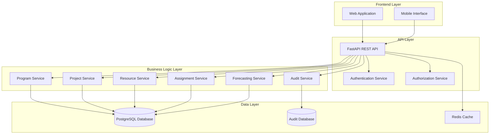
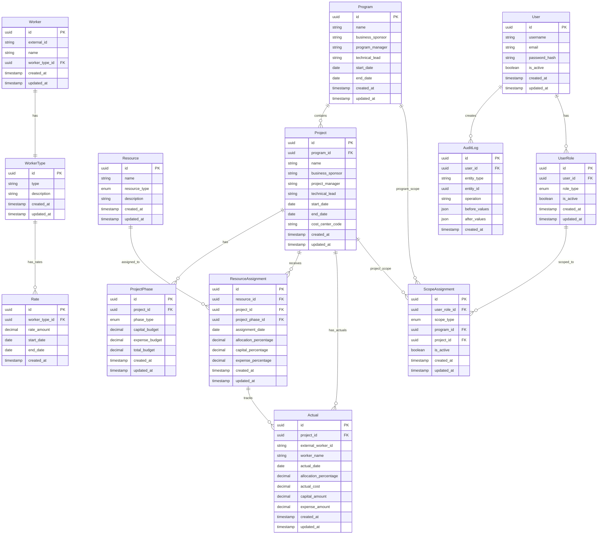
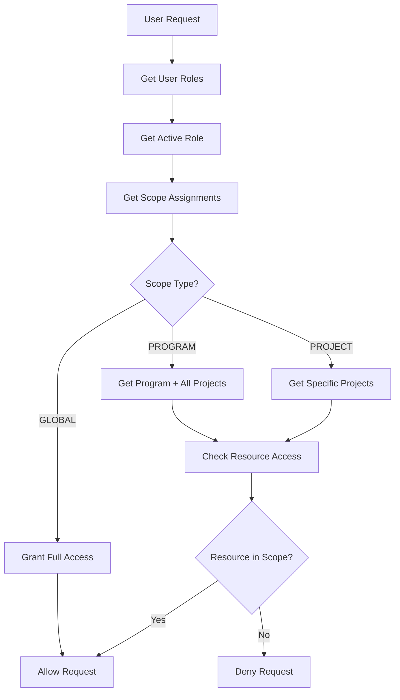
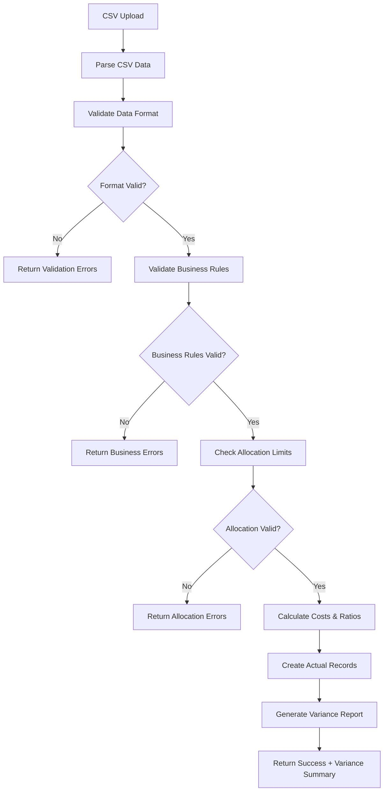

# Design Document

## Overview

The Program and Project Management System is a comprehensive enterprise application designed to manage hierarchical programs and projects with sophisticated resource allocation, budget tracking, and cost forecasting capabilities. The system provides robust audit trails, role-based access control, and supports both labor and non-labor resources with flexible accounting treatments.

The architecture follows a modern three-tier approach with a RESTful API backend, relational database, and web-based frontend. The system emphasizes data integrity, auditability, and real-time financial reporting capabilities.

## Architecture

### High-Level Architecture



### Technology Stack

**Backend:**
- **Framework**: FastAPI (Python) for high-performance REST API
- **Database**: PostgreSQL for ACID compliance and complex queries
- **ORM**: SQLAlchemy for database abstraction and migrations
- **Authentication**: JWT tokens with refresh mechanism
- **Authorization**: Custom RBAC implementation
- **Caching**: Redis for session management and query caching
- **Task Queue**: Celery for background processing (imports, reports)

**Frontend:**
- **Framework**: React with TypeScript for type safety
- **State Management**: Redux Toolkit for complex state management
- **UI Library**: Material-UI for consistent design system
- **Data Fetching**: React Query for server state management
- **Charts**: Chart.js for financial reporting visualizations

**Infrastructure:**
- **Containerization**: Docker for deployment consistency
- **API Documentation**: OpenAPI/Swagger for API documentation
- **Testing**: Pytest for backend, Jest/React Testing Library for frontend
- **CI/CD**: GitHub Actions for automated testing and deployment

## Components and Interfaces

### Core Domain Models

#### Program Management
- **ProgramService**: Handles program CRUD operations, validation, and business rules
- **ProgramRepository**: Data access layer for program entities
- **ProgramController**: REST API endpoints for program management

#### Project Management
- **ProjectService**: Manages project lifecycle, phase transitions, and budget allocation
- **ProjectRepository**: Data persistence for project entities
- **ProjectController**: API endpoints for project operations
- **PhaseService**: Handles planning and execution phase management

#### Resource Management
- **ResourceService**: Manages both labor and non-labor resources
- **WorkerService**: Specialized service for worker management
- **WorkerTypeService**: Handles worker type configuration
- **RateService**: Manages historical rate information with temporal validity

#### Assignment Management
- **AssignmentService**: Handles resource-to-project assignments with conflict detection
- **AllocationValidator**: Ensures resource allocation constraints (≤100% per day)
- **ImportService**: Handles bulk assignment imports with validation

#### Financial Management
- **BudgetService**: Manages program and project budgets with capital/expense splits
- **ForecastingService**: Calculates cost projections based on assignments and rates
- **ActualsService**: Handles actual cost data ingestion and validation
- **ActualsImportService**: Processes CSV imports of actual work data with allocation validation
- **AllocationValidatorService**: Ensures worker allocations never exceed 100% across all projects on any given day
- **VarianceAnalysisService**: Compares actual vs forecasted allocations and highlights discrepancies
- **ReportingService**: Generates budget vs actual vs forecast reports

#### Audit and Security
- **AuditService**: Tracks all data modifications with complete change history
- **AuthenticationService**: Handles user login, token management, and session control
- **AuthorizationService**: Implements RBAC with program/project-level scopes
- **ScopeValidatorService**: Validates user access to programs and projects based on scope assignments
- **PermissionCacheService**: Manages caching of user permissions and scope resolutions
- **UserService**: Manages user accounts and role assignments
- **RoleManagementService**: Handles user role assignments and scope configurations

### API Interface Design

#### RESTful Endpoints Structure

```
/api/v1/
├── /auth/
│   ├── POST /login
│   ├── POST /refresh
│   └── POST /logout
├── /programs/
│   ├── GET /programs
│   ├── POST /programs
│   ├── GET /programs/{id}
│   ├── PUT /programs/{id}
│   └── DELETE /programs/{id}
├── /projects/
│   ├── GET /projects
│   ├── POST /projects
│   ├── GET /projects/{id}
│   ├── PUT /projects/{id}
│   ├── DELETE /projects/{id}
│   └── GET /projects/{id}/phases
├── /resources/
│   ├── GET /resources
│   ├── POST /resources
│   ├── GET /resources/{id}
│   ├── PUT /resources/{id}
│   └── DELETE /resources/{id}
├── /workers/
│   ├── GET /workers
│   ├── POST /workers
│   ├── GET /workers/{id}
│   ├── PUT /workers/{id}
│   └── DELETE /workers/{id}
├── /assignments/
│   ├── GET /assignments
│   ├── POST /assignments
│   ├── PUT /assignments/{id}
│   ├── DELETE /assignments/{id}
│   └── POST /assignments/import
├── /actuals/
│   ├── GET /actuals
│   ├── POST /actuals
│   ├── PUT /actuals/{id}
│   ├── DELETE /actuals/{id}
│   ├── POST /actuals/import
│   └── GET /actuals/variance/{project_id}
├── /forecasting/
│   ├── GET /forecasting/project/{id}
│   ├── GET /forecasting/program/{id}
│   └── GET /forecasting/budget-vs-actual/{id}
└── /audit/
    ├── GET /audit/entity/{type}/{id}
    └── GET /audit/user/{user_id}
```

## Data Models

### Core Entity Relationships



### Database Schema Considerations

**Indexing Strategy:**
- Primary keys on all tables (UUID)
- Foreign key indexes for join performance
- Composite indexes on frequently queried combinations:
  - (resource_id, assignment_date) for assignment queries
  - (project_id, assignment_date) for project resource views
  - (worker_type_id, start_date, end_date) for rate lookups

**Constraints:**
- Check constraints for percentage validations (0-100%)
- Check constraints for budget component sums
- Unique constraints on business keys (external_id, cost_center_code)
- Date range constraints (start_date < end_date)

**Temporal Data Handling:**
- Rate table uses start_date/end_date for temporal validity
- Audit logs maintain complete change history
- Soft deletes for critical business entities

## Scoped Permissions System

### Permission Model Architecture

The system implements a flexible role-based access control (RBAC) system with hierarchical scoping that allows administrators to grant users specific permissions at different organizational levels.

#### Core Permission Concepts

**Role Types (Enum):**
- `ADMIN`: Full system access with user management capabilities
- `PROGRAM_MANAGER`: Program-level management with budget and resource oversight
- `PROJECT_MANAGER`: Project-level management with resource assignment capabilities
- `FINANCE_MANAGER`: Financial oversight with budget and cost analysis access
- `RESOURCE_MANAGER`: Resource and worker management capabilities
- `VIEWER`: Read-only access to assigned scope

**Scope Types (Enum):**
- `PROGRAM`: Grants access to a specific program and all its projects
- `PROJECT`: Grants access to specific projects only
- `GLOBAL`: Full system access (typically for admins)

#### Data Model Design

**UserRole Table:**
- Links users to their assigned roles
- Supports multiple roles per user
- Includes activation status for role switching

**ScopeAssignment Table:**
- Links user roles to specific organizational scopes
- Supports both program-level and project-level scoping
- Allows multiple scope assignments per user role
- Uses nullable foreign keys (program_id OR project_id, not both)

#### Permission Resolution Logic



#### Scope Inheritance Rules

**Program Scope Inheritance:**
1. **Program Access**: User can view/edit the assigned program
2. **Project Access**: User automatically gets access to ALL projects within the program
3. **New Project Access**: When new projects are created in the program, user automatically gains access
4. **Resource Access**: User can manage resources assigned to any project within the program

**Project Scope Limitations:**
1. **Project Access**: User can only view/edit specifically assigned projects
2. **Program Visibility**: User can see program information but cannot edit program-level data
3. **Resource Access**: User can only manage resources assigned to their specific projects
4. **Sibling Projects**: User cannot access other projects in the same program

#### Multi-Scope Combinations

**Supported Combinations:**
- **Multiple Program Scopes**: User can have access to multiple programs
- **Mixed Scopes**: User can have program scope for some programs + project scope for specific projects in other programs
- **Role-Specific Scopes**: Different roles can have different scope assignments

**Example Scenario:**
```
User: John Smith
Role 1: PROGRAM_MANAGER
  - Scope: PROGRAM (Digital Transformation Program)
Role 2: PROJECT_MANAGER  
  - Scope: PROJECT (Mobile App Project in Marketing Program)
  - Scope: PROJECT (Web Portal Project in Marketing Program)
```

### Authorization Service Implementation

#### Core Authorization Methods

**ScopeValidator Class:**
```python
class ScopeValidator:
    def get_user_accessible_programs(user_id: UUID) -> List[UUID]
    def get_user_accessible_projects(user_id: UUID) -> List[UUID]
    def can_access_program(user_id: UUID, program_id: UUID) -> bool
    def can_access_project(user_id: UUID, project_id: UUID) -> bool
    def get_effective_permissions(user_id: UUID, resource_type: str) -> List[Permission]
```

#### Data Filtering Strategies

**Query-Level Filtering:**
- All database queries automatically filtered by user scope
- Repository layer applies scope filters transparently
- Prevents accidental data exposure through forgotten filters

**API-Level Filtering:**
- Middleware validates resource access before processing requests
- Returns 403 Forbidden for out-of-scope access attempts
- Logs unauthorized access attempts for security monitoring

#### Caching Strategy

**Permission Cache:**
- User permissions cached in Redis for performance
- Cache invalidated on role/scope changes
- TTL-based expiration with manual refresh capability

**Scope Resolution Cache:**
- Program/project scope mappings cached
- Invalidated when organizational structure changes
- Supports bulk cache refresh for large organizational changes

### User Interface Integration

#### Role Switching Interface

**Header Profile Menu:**
- **Current Role Display**: Shows active role with color-coded badge
- **Role Switcher**: Dropdown to switch between assigned roles
- **Scope Context**: Shows current scope (program/project names)
- **Scope Switcher**: Allows switching between different scope assignments for the same role

#### Scope-Aware Navigation

**Menu Filtering:**
- Navigation items shown/hidden based on current role and scope
- Disabled menu items for insufficient permissions
- Contextual help explaining permission requirements

**Data Presentation:**
- All lists automatically filtered by user scope
- Breadcrumbs show scope context (Program > Project hierarchy)
- Search results limited to accessible entities

#### Permission Feedback

**Visual Indicators:**
- Grayed-out buttons for insufficient permissions
- Tooltip explanations for disabled functionality
- Clear messaging when no data is available due to scope limitations

**Error Handling:**
- Friendly error messages for permission denials
- Suggestions for requesting additional access
- Contact information for administrators

### Security Considerations

#### Access Control Enforcement

**Defense in Depth:**
- Database-level row security policies
- Application-level permission checks
- API gateway authorization
- Frontend permission validation

**Audit Requirements:**
- All permission changes logged
- Access attempts (successful and failed) recorded
- Regular permission review reports
- Compliance reporting for scope assignments

#### Data Isolation

**Tenant Isolation:**
- Program-scoped users cannot see other programs' data
- Project-scoped users cannot access sibling projects
- Cross-program resource sharing requires explicit permissions

**Performance Optimization:**
- Efficient scope query patterns
- Indexed scope lookup tables
- Minimal permission check overhead
- Bulk permission validation for batch operations

## Actuals Data Import System

### Import Format Specification

The system accepts actuals data in CSV format with the following structure:

```csv
project_id,external_worker_id,worker_name,date,percentage
550e8400-e29b-41d4-a716-446655440000,EMP001,John Smith,2024-01-15,75.0
550e8400-e29b-41d4-a716-446655440000,EMP002,Jane Doe,2024-01-15,50.0
```

**Field Definitions:**
- `project_id`: UUID of the target project
- `external_worker_id`: External identifier for the worker (matches Worker.external_id)
- `worker_name`: Worker's display name (for validation and user feedback)
- `date`: Work date in YYYY-MM-DD format
- `percentage`: Allocation percentage (0.0-100.0) representing time spent on this project

### Import Validation Rules

**Data Integrity Validation:**
1. **Project Existence**: Project ID must exist in the system
2. **Worker Validation**: External worker ID must match an existing worker
3. **Name Consistency**: Worker name must match the name associated with the external worker ID
4. **Date Format**: Date must be valid and in ISO format (YYYY-MM-DD)
5. **Percentage Range**: Percentage must be between 0.0 and 100.0

**Allocation Validation:**
1. **Daily Allocation Limit**: Combined actuals for any worker on any given day cannot exceed 100%
2. **Cross-Project Validation**: Validation considers existing actuals across all projects for the same worker/date
3. **Incremental Import**: New imports are validated against existing actuals data
4. **Conflict Resolution**: Import fails if any worker would exceed 100% allocation on any day

### Cost Calculation and Capital/Expense Allocation

**Rate Application:**
1. **Worker Rate Lookup**: System retrieves the applicable rate for the worker type on the actual date
2. **Cost Calculation**: `actual_cost = (percentage / 100) * daily_rate`
3. **Capital/Expense Split**: Applied based on the resource assignment's capital/expense percentages for that project

**Assignment Matching Logic:**
1. **Project Assignment Lookup**: Find the resource assignment for the worker on the project
2. **Date Range Validation**: Ensure the actual date falls within the assignment period
3. **Ratio Application**: Apply the assignment's capital_percentage and expense_percentage to the calculated cost

### Variance Analysis and Reporting

**Actual vs Forecast Comparison:**
- **Allocation Variance**: Compare actual allocation percentages vs forecasted assignments
- **Date Variance**: Identify days where actuals exist but no forecast assignment was planned
- **Resource Variance**: Highlight workers working on projects they weren't originally assigned to

**Variance Reporting Features:**
- **Daily Variance Reports**: Show allocation differences by worker and project for specific dates
- **Project Variance Summary**: Aggregate variance metrics at the project level
- **Worker Utilization Analysis**: Compare planned vs actual utilization across all projects
- **Exception Reporting**: Flag significant variances (e.g., >20% difference from forecast)

### Import Processing Workflow



**Error Handling:**
- **Validation Errors**: Detailed error messages with row numbers and specific issues
- **Partial Import Support**: Option to import valid rows while reporting invalid ones
- **Rollback Capability**: Transaction-based import with rollback on critical errors
- **Audit Trail**: All import attempts logged with user attribution and timestamps

## User Interface Design

### UI Architecture and Navigation

The web application follows a modern single-page application (SPA) design with a responsive layout that works across desktop, tablet, and mobile devices. The interface emphasizes clarity, efficiency, and data-driven decision making.

#### Main Navigation Structure

```mermaid
graph TD
    A[Dashboard] --> B[Programs]
    A --> C[Projects]
    A --> D[Resources]
    A --> E[Workers]
    A --> F[Actuals]
    A --> G[Reports]
    A --> H[Admin]
    
    B --> B1[Program List]
    B --> B2[Create Program]
    B --> B3[Program Details]
    
    C --> C1[Project List]
    C --> C2[Create Project]
    C --> C3[Project Details]
    C --> C4[Resource Assignments]
    
    D --> D1[Resource List]
    D --> D2[Create Resource]
    D --> D3[Resource Details]
    
    E --> E1[Worker List]
    E --> E2[Create Worker]
    E --> E3[Worker Types]
    E --> E4[Rate Management]
    
    F --> F1[Actuals List]
    F --> F2[Import Actuals]
    F --> F3[Variance Analysis]
    
    G --> G1[Budget vs Actual]
    G --> G2[Forecasting]
    G --> G3[Utilization Reports]
    G --> G4[Variance Reports]
    
    H --> H1[User Management]
    H --> H2[Audit Logs]
    H --> H3[System Settings]
```



#### Header Navigation Design

**Top Navigation Bar Layout:**
```
[Logo] [Dashboard] [Programs] [Projects] [Resources] [Workers] [Actuals] [Reports] [Admin]     [Notifications] [User Profile ▼]
```

**User Profile Section (Right Side of Header):**
- **User Avatar**: Profile picture or initials in circular badge
- **User Information Display**: 
  - **Name**: "John Smith" (clickable for profile menu)
  - **Role Badge**: Color-coded role indicator (e.g., "Program Manager", "Admin", "Finance")
  - **Scope Indicator**: Shows current access scope if applicable (e.g., "Program: Digital Transformation")

**User Profile Dropdown Menu:**
- **Profile Information**:
  - Full name and email
  - Current role(s) with color-coded badges
  - Access scope(s) - programs/projects user can access
- **Quick Actions**:
  - Switch Role (if user has multiple roles)
  - Change Scope (if user has access to multiple programs)
  - View My Activity (personal audit log)
- **Account Settings**:
  - Edit Profile
  - Change Password
  - Notification Preferences
- **System Actions**:
  - Help & Documentation
  - Logout

**Role-Based Visual Indicators:**
- **Admin**: Red badge with "Admin" text
- **Program Manager**: Blue badge with "Program Mgr" text  
- **Project Manager**: Green badge with "Project Mgr" text
- **Finance Manager**: Purple badge with "Finance" text
- **Resource Manager**: Orange badge with "Resource Mgr" text
- **Viewer**: Gray badge with "Viewer" text

**Scope Context Display:**
When user has limited scope access, show context below the user name:
- **Program Scope**: "Access: Digital Transformation Program"
- **Project Scope**: "Access: Mobile App Project, Web Portal Project"
- **Full Access**: No additional text shown

### Core UI Screens

#### 1. Dashboard Screen
**Purpose**: Executive overview with key metrics and alerts

**Layout Components:**
- **Header**: Navigation bar with logo, main menu, notifications, and user profile section
  - **User Context Display**: Shows current user name, role badge, and access scope
  - **Profile Dropdown**: Role switching, scope selection, account settings, logout
- **KPI Cards**: Budget utilization, active projects, resource allocation, variance alerts
- **Charts Section**: 
  - Budget vs Actual trend chart (last 12 months)
  - Resource utilization heatmap
  - Top variance projects (bar chart)
- **Quick Actions Panel**: Create project, import actuals, view reports
- **Recent Activity Feed**: Latest changes, imports, and system events

**Key Features:**
- Real-time data updates using WebSocket connections
- Drill-down capability from charts to detailed views
- Customizable dashboard widgets based on user role and permissions
- Alert notifications for budget overruns and allocation conflicts
- **Role-Based Content**: Dashboard widgets and actions filtered by user permissions

#### 2. Program Management Screens

##### 2.1 Program List Screen
**Layout:**
- **Filter Bar**: Search by name, sponsor, manager, date range, status
- **Data Table**: Sortable columns with program details
  - Program Name | Business Sponsor | Program Manager | Start Date | End Date | # Projects | Status
- **Action Buttons**: Create Program, Bulk Actions, Export
- **Pagination**: Server-side pagination for large datasets

##### 2.2 Program Details Screen
**Layout:**
- **Header Section**: Program name, key details, edit/delete actions
- **Tabs Navigation**:
  - **Overview**: Basic information, timeline, key stakeholders
  - **Projects**: Associated projects with summary metrics
  - **Budget Summary**: Aggregated budget vs actual across all projects
  - **Timeline**: Gantt chart view of program and project timelines
- **Side Panel**: Quick stats, recent changes, related documents

#### 3. Project Management Screens

##### 3.1 Project List Screen
**Layout:**
- **Advanced Filters**: Program, manager, status, date range, budget range
- **Data Table**: Enhanced project information
  - Project Name | Program | Manager | Phase | Budget | Actual | Variance | Status
- **Bulk Operations**: Status updates, budget adjustments, export
- **View Options**: Table view, card view, timeline view

##### 3.2 Project Details Screen
**Multi-tab interface with comprehensive project information:**

**Tab 1: Overview**
- **Project Header**: Name, description, key stakeholders, status badges
- **Key Metrics Cards**: Budget utilization, resource count, timeline progress
- **Phase Information**: Planning and execution phases with separate budgets
- **Timeline Visualization**: Project phases with milestones and dependencies

**Tab 2: Resource Assignments**
- **Assignment Calendar**: Monthly calendar view showing resource allocations
- **Resource List**: Table with worker details, allocation percentages, date ranges
- **Allocation Chart**: Stacked bar chart showing daily resource utilization
- **Actions**: Add assignment, bulk import, conflict resolution

**Tab 3: Budget & Financials**
- **Budget Breakdown**: Capital vs expense allocation with visual charts
- **Actual vs Forecast**: Line chart comparing planned vs actual spending
- **Cost Analysis**: Detailed breakdown by resource type and time period
- **Variance Analysis**: Highlighting significant deviations with explanations

**Tab 4: Actuals & Variance**
- **Actuals Summary**: Recent actual work entries with validation status
- **Variance Dashboard**: Actual vs planned allocation comparisons
- **Exception Reports**: Workers exceeding planned allocations or working unassigned
- **Import History**: Log of actuals imports with success/failure details

#### 4. Resource Management Screens

##### 4.1 Worker Management Screen
**Layout:**
- **Worker Directory**: Searchable list with photos, skills, availability
- **Filter Options**: Worker type, availability, current assignments
- **Worker Cards**: Compact view showing key information and current utilization
- **Bulk Actions**: Type assignment, rate updates, status changes

##### 4.2 Worker Details Screen
**Sections:**
- **Personal Information**: Contact details, worker type, employment status
- **Rate History**: Timeline of rate changes with effective dates
- **Assignment History**: Past and current project assignments
- **Utilization Chart**: Historical allocation percentages across projects
- **Performance Metrics**: Actual vs planned work completion rates

#### 5. Actuals Import and Management

##### 5.1 Actuals Import Screen
**Step-by-step import wizard:**

**Step 1: File Upload**
- **Drag & Drop Zone**: CSV file upload with format validation
- **Template Download**: Link to download CSV template with sample data
- **Format Guidelines**: Clear instructions on required format and validation rules

**Step 2: Data Preview**
- **Data Table**: Preview of parsed CSV data with validation indicators
- **Error Highlighting**: Red highlighting for validation errors with tooltips
- **Summary Stats**: Total records, valid records, error count

**Step 3: Validation Results**
- **Validation Summary**: Pass/fail status with detailed error breakdown
- **Allocation Conflicts**: List of workers exceeding 100% allocation
- **Business Rule Violations**: Missing projects, invalid workers, date issues
- **Options**: Fix errors and retry, import valid records only, cancel import

**Step 4: Import Confirmation**
- **Impact Summary**: Records to be created, cost calculations, affected projects
- **Variance Preview**: Expected variance from current forecasts
- **Final Confirmation**: Checkbox confirmations and import button

##### 5.2 Actuals Management Screen
**Layout:**
- **Filter Panel**: Date range, project, worker, variance threshold
- **Data Table**: Actual work entries with calculated costs and variances
- **Variance Indicators**: Color-coded variance levels (green/yellow/red)
- **Bulk Actions**: Edit, delete, recalculate costs, export

#### 6. Reporting and Analytics Screens

##### 6.1 Budget vs Actual Dashboard
**Interactive reporting interface:**
- **Time Period Selector**: Monthly, quarterly, yearly views
- **Program/Project Filter**: Hierarchical selection with multi-select
- **Chart Types**: Toggle between line charts, bar charts, and tables
- **Variance Analysis**: Configurable variance thresholds with drill-down
- **Export Options**: PDF reports, Excel exports, scheduled reports

##### 6.2 Resource Utilization Reports
**Comprehensive utilization analytics:**
- **Utilization Heatmap**: Calendar view showing resource allocation density
- **Worker Utilization Chart**: Individual worker utilization over time
- **Project Resource Analysis**: Resource distribution across projects
- **Capacity Planning**: Forecasted resource needs vs availability

##### 6.3 Variance Analysis Dashboard
**Detailed variance tracking:**
- **Variance Trends**: Time-series analysis of actual vs planned variances
- **Exception Reports**: Automated identification of significant variances
- **Root Cause Analysis**: Drill-down capabilities to identify variance sources
- **Corrective Action Tracking**: Status of variance resolution efforts

### UI Design Principles and Standards

#### Visual Design System
- **Color Palette**: Professional blue/gray scheme with accent colors for status indicators
- **Typography**: Clean, readable fonts with consistent hierarchy (Roboto/Inter)
- **Spacing**: 8px grid system for consistent spacing and alignment
- **Icons**: Material Design icons for consistency and recognition

#### Responsive Design
- **Desktop**: Full-featured interface with multi-column layouts
- **Tablet**: Adaptive layout with collapsible sidebars and touch-friendly controls
- **Mobile**: Simplified navigation with priority-based content display

#### Accessibility Standards
- **WCAG 2.1 AA Compliance**: Color contrast, keyboard navigation, screen reader support
- **Keyboard Navigation**: Full functionality accessible via keyboard shortcuts
- **Screen Reader Support**: Proper ARIA labels and semantic HTML structure
- **High Contrast Mode**: Alternative color schemes for visual impairments

#### User Experience Patterns
- **Progressive Disclosure**: Complex information revealed in logical steps
- **Contextual Help**: Inline tooltips and help text for complex features
- **Confirmation Dialogs**: Clear confirmation for destructive actions
- **Loading States**: Progress indicators for long-running operations
- **Error Handling**: Clear, actionable error messages with recovery suggestions

### State Management and Data Flow

#### Frontend State Architecture
- **Global State**: User authentication, permissions, application settings
- **Feature State**: Entity-specific state (programs, projects, resources)
- **UI State**: Modal visibility, form states, loading indicators
- **Cache Management**: Intelligent caching of frequently accessed data

#### Real-time Updates
- **WebSocket Integration**: Live updates for critical data changes
- **Optimistic Updates**: Immediate UI feedback with server confirmation
- **Conflict Resolution**: Handling concurrent edits with user notification
- **Offline Support**: Basic functionality when network connectivity is limited

### Performance Considerations

#### Frontend Optimization
- **Code Splitting**: Lazy loading of route-based components
- **Virtual Scrolling**: Efficient rendering of large data tables
- **Image Optimization**: Responsive images with lazy loading
- **Bundle Optimization**: Tree shaking and minification for production builds

#### Data Loading Strategies
- **Pagination**: Server-side pagination for large datasets
- **Infinite Scroll**: Progressive loading for timeline and activity feeds
- **Prefetching**: Anticipatory loading of likely-needed data
- **Caching**: Intelligent client-side caching with cache invalidation
