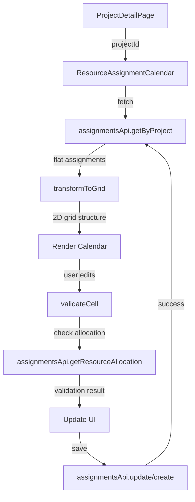

# Design Document: Resource Assignment Calendar View

## Overview

The Resource Assignment Calendar View transforms the flat assignments table into a calendar-style grid that visualizes resource allocations over time. The view displays resources in rows (with separate Capital and Expense sub-rows) and dates in columns, allowing project managers to see allocation patterns at a glance. The component supports both read-only viewing and inline editing with real-time validation against cross-project allocation limits.

## Architecture

### Component Structure

```
ResourceAssignmentCalendar (new component)
├── CalendarHeader (date columns)
├── ResourceRow (repeating)
│   ├── ResourceNameCell (sticky)
│   ├── CapitalRow
│   │   └── EditableCell[] (one per date)
│   └── ExpenseRow
│       └── EditableCell[] (one per date)
└── EditControls (Edit/Save/Cancel buttons)
```

### Data Flow



### Integration Points

- **ProjectDetailPage**: Parent component that renders the calendar in the Assignments tab
- **assignmentsApi**: Existing API client for fetching and updating assignment data
- **projectsApi**: Used to get project start_date and end_date for date range generation
- **Permission System**: Checks user permissions before enabling edit mode

## Components and Interfaces

### ResourceAssignmentCalendar Component

**Props:**
```typescript
interface ResourceAssignmentCalendarProps {
  projectId: string
  projectStartDate: string
  projectEndDate: string
  onSaveSuccess?: () => void
  onSaveError?: (error: string) => void
}
```

**State:**
```typescript
interface CalendarState {
  assignments: ResourceAssignment[]
  gridData: GridData
  isEditMode: boolean
  editedCells: Map<string, CellEdit>
  validationErrors: Map<string, string>
  isLoading: boolean
  isSaving: boolean
}

interface GridData {
  resources: ResourceInfo[]
  dates: Date[]
  cells: Map<string, CellData>
}

interface ResourceInfo {
  resourceId: string
  resourceName: string
}

interface CellData {
  assignmentId?: string
  capitalPercentage: number
  expensePercentage: number
}

interface CellEdit {
  resourceId: string
  date: Date
  costTreatment: 'capital' | 'expense'
  oldValue: number
  newValue: number
}
```

### EditableCell Component

**Props:**
```typescript
interface EditableCellProps {
  resourceId: string
  date: Date
  costTreatment: 'capital' | 'expense'
  value: number
  isEditMode: boolean
  hasError: boolean
  errorMessage?: string
  onChange: (newValue: number) => void
  onBlur: () => void
}
```

**Behavior:**
- Displays percentage value in read-only mode
- Becomes input field in edit mode
- Validates on blur, tab, or enter key
- Shows error state with tooltip/message

### CalendarHeader Component

**Props:**
```typescript
interface CalendarHeaderProps {
  dates: Date[]
  formatDate: (date: Date) => string
}
```

**Behavior:**
- Renders date column headers
- Applies consistent styling (#A5C1D8 background, bold text)
- Handles horizontal scrolling

### ResourceRow Component

**Props:**
```typescript
interface ResourceRowProps {
  resource: ResourceInfo
  dates: Date[]
  capitalCells: Map<string, CellData>
  expenseCells: Map<string, CellData>
  isEditMode: boolean
  onCellChange: (edit: CellEdit) => void
  onCellBlur: (resourceId: string, date: Date, costTreatment: string) => void
  validationErrors: Map<string, string>
}
```

**Behavior:**
- Renders two rows: Capital and Expense
- First cell is sticky (resource name)
- Remaining cells are editable based on mode
- Applies visual distinction between Capital and Expense rows

## Data Models

### Grid Transformation

The transformation from flat assignment list to 2D grid structure:

```typescript
function transformToGrid(
  assignments: ResourceAssignment[],
  startDate: Date,
  endDate: Date
): GridData {
  // 1. Extract unique resources
  const resourceMap = new Map<string, ResourceInfo>()
  assignments.forEach(a => {
    if (!resourceMap.has(a.resource_id)) {
      resourceMap.set(a.resource_id, {
        resourceId: a.resource_id,
        resourceName: a.resource_name || a.resource_id
      })
    }
  })
  
  // 2. Generate date range
  const dates: Date[] = []
  let currentDate = new Date(startDate)
  const end = new Date(endDate)
  while (currentDate <= end) {
    dates.push(new Date(currentDate))
    currentDate.setDate(currentDate.getDate() + 1)
  }
  
  // 3. Create cell map with composite keys
  const cells = new Map<string, CellData>()
  assignments.forEach(a => {
    const key = getCellKey(a.resource_id, a.assignment_date, 'capital')
    cells.set(key, {
      assignmentId: a.id,
      capitalPercentage: a.capital_percentage,
      expensePercentage: a.expense_percentage
    })
  })
  
  return {
    resources: Array.from(resourceMap.values()),
    dates,
    cells
  }
}

function getCellKey(
  resourceId: string,
  date: Date | string,
  costTreatment: 'capital' | 'expense'
): string {
  const dateStr = typeof date === 'string' ? date : date.toISOString().split('T')[0]
  return `${resourceId}:${dateStr}:${costTreatment}`
}
```

### Cell Lookup

Efficient O(1) lookup using composite keys:

```typescript
function getCellValue(
  gridData: GridData,
  resourceId: string,
  date: Date,
  costTreatment: 'capital' | 'expense'
): number {
  const key = getCellKey(resourceId, date, costTreatment)
  const cellData = gridData.cells.get(key)
  
  if (!cellData) return 0
  
  return costTreatment === 'capital'
    ? cellData.capitalPercentage
    : cellData.expensePercentage
}
```

### Edit Tracking

Track changes before persisting:

```typescript
interface EditTracker {
  edits: Map<string, CellEdit>
  
  addEdit(edit: CellEdit): void
  removeEdit(key: string): void
  hasEdits(): boolean
  getEdits(): CellEdit[]
  clear(): void
}

function createEditTracker(): EditTracker {
  const edits = new Map<string, CellEdit>()
  
  return {
    edits,
    
    addEdit(edit: CellEdit) {
      const key = getCellKey(edit.resourceId, edit.date, edit.costTreatment)
      edits.set(key, edit)
    },
    
    removeEdit(key: string) {
      edits.delete(key)
    },
    
    hasEdits() {
      return edits.size > 0
    },
    
    getEdits() {
      return Array.from(edits.values())
    },
    
    clear() {
      edits.clear()
    }
  }
}
```

## Correctness Properties

*A property is a characteristic or behavior that should hold true across all valid executions of a system—essentially, a formal statement about what the system should do. Properties serve as the bridge between human-readable specifications and machine-verifiable correctness guarantees.*


### Property Reflection

After analyzing all acceptance criteria, I identified the following redundancies:
- Properties 1.4 and 2.1 both test that there are exactly 2 rows per resource (duplicate)
- Properties 2.2 and 2.3 can be combined into one property about row labeling
- Properties 4.1 and 4.2 can be combined into one property about data mapping
- Properties 5.2, 5.3, and 5.4 are all covered by the general grid transformation property (5.1)
- Many edge cases (3.5, 4.5, 5.5, 6.4, 9.1, 9.2, 9.3) will be handled by generators in property tests
- UI interaction tests (11-17) are mostly examples rather than properties

The following properties provide unique validation value:

Property 1: Date range generation completeness
Property 2: Grid structure correctness (rows per resource)
Property 3: Cell data mapping correctness
Property 4: Grid transformation round-trip
Property 5: Allocation validation correctness
Property 6: Percentage range validation

### Correctness Properties

Property 1: Date Range Generation Completeness
*For any* valid project with start_date and end_date, the generated date array should contain exactly the number of days between start and end (inclusive), with the first date equal to start_date and the last date equal to end_date.
**Validates: Requirements 3.1, 3.2, 3.3**

Property 2: Grid Structure Correctness
*For any* set of assignments with N unique resources, the transformed grid should contain exactly 2N rows (one Capital row and one Expense row per resource), and each resource should have its Capital and Expense rows adjacent to each other.
**Validates: Requirements 1.4, 2.1, 2.2, 2.3, 2.5**

Property 3: Cell Data Mapping Correctness
*For any* assignment in the input data, looking up the grid cell for that assignment's resource_id, assignment_date, and cost treatment (capital or expense) should return the correct percentage value from the assignment.
**Validates: Requirements 4.1, 4.2, 5.2, 5.3, 5.4**

Property 4: Grid Transformation Preserves Data
*For any* list of assignments, transforming to grid and then extracting all non-zero cells should produce a set of assignments equivalent to the original input (no data loss, no data corruption).
**Validates: Requirements 5.1, 6.2**

Property 5: Cross-Project Allocation Validation
*For any* resource and date, if the sum of allocation_percentage across all projects (including both capital_percentage and expense_percentage) exceeds 100%, the validation should reject the change and provide details about the over-allocation.
**Validates: Requirements 13.4, 15.2, 15.3**

Property 6: Percentage Range Validation
*For any* cell edit, if the new percentage value is less than 0 or greater than 100, the validation should reject the change.
**Validates: Requirements 12.4**

## Error Handling

### Validation Errors

**Client-Side Validation:**
- Percentage out of range (0-100): Display inline error, prevent save
- Non-numeric input: Display inline error, revert to previous value
- Over-allocation (>100% on a date): Display detailed error with project breakdown

**Server-Side Validation:**
- Permission denied: Display error message, disable edit mode
- Concurrent modification: Display error, offer to refresh and retry
- Database constraint violation: Display error, revert changes

### API Errors

**Network Errors:**
- Fetch failure: Display error message with retry button
- Save failure: Display error message, preserve edits, allow retry
- Timeout: Display timeout message with retry option

**Error Display Strategy:**
- Inline errors for cell-level validation (tooltip or border highlight)
- Toast/snackbar for save success/failure
- Modal dialog for critical errors requiring user action

### Error Recovery

```typescript
interface ErrorRecovery {
  // Preserve user edits on save failure
  preserveEditsOnError(): void
  
  // Retry failed save operation
  retrySave(): Promise<void>
  
  // Refresh data and discard edits
  refreshAndDiscard(): Promise<void>
  
  // Revert specific cell edit
  revertCellEdit(key: string): void
}
```

## Testing Strategy

### Dual Testing Approach

This feature requires both unit tests and property-based tests to ensure comprehensive coverage:

**Unit Tests** focus on:
- Specific examples of grid transformation
- Edge cases (empty assignments, missing dates, null values)
- UI interactions (button clicks, mode toggles)
- Error handling scenarios
- API integration points

**Property-Based Tests** focus on:
- Universal properties that hold for all inputs
- Grid transformation correctness across random data
- Validation logic across random allocations
- Date range generation for arbitrary date ranges

Together, these approaches provide comprehensive coverage where unit tests catch concrete bugs and property tests verify general correctness.

### Property-Based Testing Configuration

**Library:** fast-check (TypeScript/JavaScript property-based testing library)

**Configuration:**
- Minimum 100 iterations per property test
- Each test tagged with feature name and property number
- Tag format: `Feature: resource-assignment-calendar, Property N: [property text]`

**Test Structure:**
```typescript
import fc from 'fast-check'

describe('Resource Assignment Calendar Properties', () => {
  // Feature: resource-assignment-calendar, Property 1: Date Range Generation Completeness
  it('should generate complete date range from start to end', () => {
    fc.assert(
      fc.property(
        fc.date(), // start date
        fc.date(), // end date
        (start, end) => {
          fc.pre(start <= end) // precondition
          
          const dates = generateDateRange(start, end)
          
          // Check first and last dates
          expect(dates[0]).toEqual(start)
          expect(dates[dates.length - 1]).toEqual(end)
          
          // Check completeness
          const dayCount = Math.floor((end - start) / (1000 * 60 * 60 * 24)) + 1
          expect(dates.length).toBe(dayCount)
        }
      ),
      { numRuns: 100 }
    )
  })
  
  // Feature: resource-assignment-calendar, Property 2: Grid Structure Correctness
  it('should create exactly 2 rows per resource', () => {
    fc.assert(
      fc.property(
        fc.array(fc.record({
          resource_id: fc.uuid(),
          resource_name: fc.string(),
          assignment_date: fc.date().map(d => d.toISOString()),
          capital_percentage: fc.integer({ min: 0, max: 100 }),
          expense_percentage: fc.integer({ min: 0, max: 100 })
        })),
        (assignments) => {
          const grid = transformToGrid(assignments, new Date(), new Date())
          const uniqueResources = new Set(assignments.map(a => a.resource_id))
          
          expect(grid.resources.length).toBe(uniqueResources.size)
          // Each resource should have 2 rows (capital + expense)
          // This is implicit in the grid structure
        }
      ),
      { numRuns: 100 }
    )
  })
})
```

### Unit Test Coverage

**Component Tests:**
- ResourceAssignmentCalendar: mode toggling, data loading, save/cancel
- EditableCell: input handling, validation display, blur/enter/tab events
- ResourceRow: rendering, cell organization
- CalendarHeader: date formatting, styling

**Utility Function Tests:**
- transformToGrid: specific examples with known inputs/outputs
- getCellKey: key generation consistency
- getCellValue: lookup correctness
- generateDateRange: edge cases (same day, leap years, year boundaries)

**Integration Tests:**
- Full calendar render with mock data
- Edit flow from read-only to save
- Validation error display and recovery
- API integration with mock responses

### Example Unit Tests

```typescript
describe('transformToGrid', () => {
  it('should handle empty assignments', () => {
    const grid = transformToGrid([], new Date('2024-01-01'), new Date('2024-01-31'))
    expect(grid.resources).toEqual([])
    expect(grid.dates.length).toBe(31)
    expect(grid.cells.size).toBe(0)
  })
  
  it('should map assignment to correct cell', () => {
    const assignments = [{
      id: '1',
      resource_id: 'r1',
      resource_name: 'Resource 1',
      assignment_date: '2024-01-15',
      capital_percentage: 60,
      expense_percentage: 40
    }]
    
    const grid = transformToGrid(assignments, new Date('2024-01-01'), new Date('2024-01-31'))
    
    const capitalValue = getCellValue(grid, 'r1', new Date('2024-01-15'), 'capital')
    const expenseValue = getCellValue(grid, 'r1', new Date('2024-01-15'), 'expense')
    
    expect(capitalValue).toBe(60)
    expect(expenseValue).toBe(40)
  })
})
```

## Implementation Notes

### Performance Optimizations

1. **Memoization**: Use React.useMemo for grid transformation to avoid recalculation on every render
2. **Virtual Scrolling**: Consider react-window or react-virtualized for very large date ranges (>365 days)
3. **Debounced Validation**: Debounce API calls for allocation validation to reduce server load
4. **Efficient Lookups**: Use Map data structures for O(1) cell lookups instead of array searches

### Accessibility

- Keyboard navigation: Tab through cells, Enter to edit, Escape to cancel
- ARIA labels: Proper labels for edit mode, buttons, and error messages
- Screen reader support: Announce validation errors and mode changes
- Focus management: Maintain focus on edited cell after validation

### Browser Compatibility

- Sticky positioning: Fallback for older browsers
- Date handling: Use date-fns for consistent date operations across browsers
- CSS Grid: Ensure grid layout works in target browsers

### Future Enhancements

- Bulk edit: Select multiple cells and apply same value
- Copy/paste: Support copying allocation patterns across dates
- Undo/redo: Track edit history for better UX
- Export: Download calendar view as CSV or Excel
- Filtering: Filter resources by name or allocation status
- Color coding: Visual indicators for allocation levels (0%, 1-50%, 51-99%, 100%)
